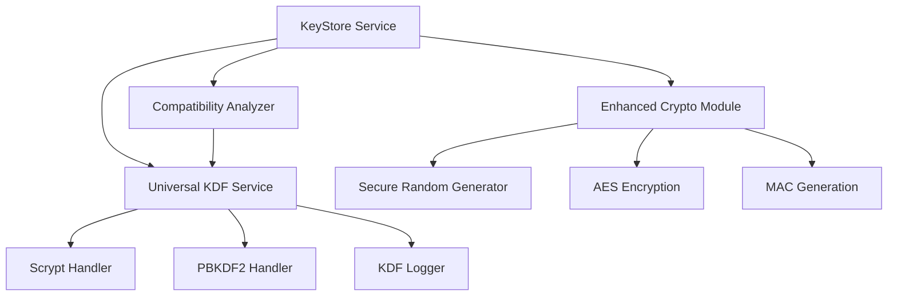

# Design Document

## Overview

This design integrates the Universal KDF system from bloco-wallet into bloco-eth to ensure maximum compatibility with Ethereum clients. The integration will replace the current basic KDF implementation with a comprehensive system that supports multiple KDF algorithms, parameter validation, normalization, and compatibility analysis.

The Universal KDF system provides a pluggable architecture where different KDF handlers can be registered and used transparently. This ensures that keystores generated by bloco-eth will work seamlessly with Besu, Go Ethereum, Anvil, Reth, Hyperledger Firefly, and other Ethereum clients.

## Architecture

### Core Components

The Universal KDF integration consists of several key components:

1. **UniversalKDFService**: Central service that manages KDF handlers and provides unified key derivation
2. **KDF Handlers**: Specific implementations for scrypt and PBKDF2 with comprehensive parameter validation
3. **Compatibility Analyzer**: Analyzes keystore compatibility and provides security assessments
4. **Enhanced KeyStore Service**: Updated keystore service that uses the Universal KDF system
5. **Migration Layer**: Ensures backward compatibility with existing keystore generation

### Component Relationships



## Components and Interfaces

### UniversalKDFService Interface

```go
type UniversalKDFService struct {
    supportedKDFs map[string]KDFHandler
    logger        KDFLogger
}

// Core methods
func NewUniversalKDFService() *UniversalKDFService
func (uks *UniversalKDFService) RegisterKDF(name string, handler KDFHandler)
func (uks *UniversalKDFService) DeriveKey(password string, crypto *CryptoParams) ([]byte, error)
func (uks *UniversalKDFService) normalizeKDFName(kdf string) string
```

### KDF Handler Interface

```go
type KDFHandler interface {
    DeriveKey(password string, params map[string]interface{}) ([]byte, error)
    ValidateParams(params map[string]interface{}) error
    GetDefaultParams() map[string]interface{}
    GetParamRange(param string) (min, max interface{})
}
```

### Enhanced KeyStore Service

```go
type EnhancedKeyStoreService struct {
    config      KeyStoreConfig
    kdfService  *UniversalKDFService
    analyzer    *KDFCompatibilityAnalyzer
    logger      ProgressLogger
}

// Enhanced methods
func (ks *EnhancedKeyStoreService) GenerateKeyStoreWithKDF(privateKeyHex, address, password string, kdfType string) (*KeyStoreV3, error)
func (ks *EnhancedKeyStoreService) ValidateKeyStoreCompatibility(keystore *KeyStoreV3) (*CompatibilityReport, error)
func (ks *EnhancedKeyStoreService) AnalyzeSecurityLevel(keystore *KeyStoreV3) (*SecurityAnalysis, error)
```

### Compatibility Analyzer

```go
type KDFCompatibilityAnalyzer struct {
    service *UniversalKDFService
}

type CompatibilityReport struct {
    Compatible    bool                   `json:"compatible"`
    KDFType       string                 `json:"kdf_type"`
    NormalizedKDF string                 `json:"normalized_kdf"`
    Parameters    map[string]interface{} `json:"parameters"`
    SecurityLevel string                 `json:"security_level"`
    Issues        []string               `json:"issues"`
    Warnings      []string               `json:"warnings"`
    Suggestions   []string               `json:"suggestions"`
}
```

## Data Models

### Enhanced CryptoParams

The existing CryptoParams structure will be enhanced to work seamlessly with the Universal KDF system:

```go
type CryptoParams struct {
    KDF          string                 `json:"kdf"`
    KDFParams    map[string]interface{} `json:"kdfparams"`
    Cipher       string                 `json:"cipher"`
    CipherText   string                 `json:"ciphertext"`
    CipherParams map[string]interface{} `json:"cipherparams"`
    MAC          string                 `json:"mac"`
}
```

### KDF Parameter Structures

```go
// Enhanced Scrypt parameters with validation
type ScryptParams struct {
    DKLen int    `json:"dklen"`
    N     int    `json:"n"`     // Must be power of 2
    P     int    `json:"p"`     // Parallelization parameter
    R     int    `json:"r"`     // Block size parameter
    Salt  string `json:"salt"`  // Hex-encoded salt
}

// Enhanced PBKDF2 parameters with hash function support
type PBKDF2Params struct {
    DKLen int    `json:"dklen"`
    C     int    `json:"c"`     // Iteration count
    PRF   string `json:"prf"`   // Pseudo-random function (hmac-sha256, hmac-sha512)
    Salt  string `json:"salt"`  // Hex-encoded salt
}
```

### Security Analysis Model

```go
type SecurityAnalysis struct {
    Level              string        `json:"level"`              // Low, Medium, High, Very High
    ComputationalCost  float64       `json:"computational_cost"` // Estimated operations
    MemoryUsage        int64         `json:"memory_usage"`       // Bytes
    TimeEstimate       time.Duration `json:"time_estimate"`      // At standard hardware
    Recommendations    []string      `json:"recommendations"`
    ClientCompatibility map[string]bool `json:"client_compatibility"` // Client -> compatible
}
```

## Error Handling

### Enhanced Error Types

```go
type KDFError struct {
    Type        string                 `json:"type"`         // validation, derivation, compatibility
    KDFType     string                 `json:"kdf_type"`
    Parameter   string                 `json:"parameter"`
    Value       interface{}            `json:"value"`
    Expected    interface{}            `json:"expected"`
    Message     string                 `json:"message"`
    Suggestions []string               `json:"suggestions"`
    Recoverable bool                   `json:"recoverable"`
}

func (e *KDFError) Error() string
func (e *KDFError) IsRecoverable() bool
func (e *KDFError) GetSuggestions() []string
```

### Error Recovery Strategies

1. **Parameter Validation Errors**: Provide specific ranges and suggest corrections
2. **KDF Not Supported**: Suggest alternative KDF with similar security properties
3. **Memory Limit Exceeded**: Suggest parameter adjustments to reduce memory usage
4. **Compatibility Issues**: Provide client-specific parameter recommendations

## Testing Strategy

### Unit Tests

1. **KDF Handler Tests**
   - Parameter validation for all supported ranges
   - Key derivation correctness against known test vectors
   - Error handling for invalid parameters
   - Memory usage validation

2. **Universal KDF Service Tests**
   - KDF registration and lookup
   - Name normalization for various formats
   - Integration between different handlers
   - Logging functionality without sensitive data exposure

3. **Compatibility Analyzer Tests**
   - Keystore compatibility analysis
   - Security level assessment
   - Report generation accuracy
   - Client-specific compatibility checks

### Integration Tests

1. **End-to-End Keystore Generation**
   - Generate keystores with different KDF algorithms
   - Validate compatibility with actual Ethereum clients
   - Test keystore loading and private key recovery
   - Performance benchmarks for different parameter sets

2. **Client Compatibility Tests**
   - Test generated keystores with Besu
   - Test generated keystores with Go Ethereum (geth)
   - Test generated keystores with Anvil
   - Test generated keystores with Reth
   - Test generated keystores with Hyperledger Firefly

3. **Migration Tests**
   - Ensure existing keystore generation still works
   - Validate backward compatibility
   - Test configuration migration

### Property-Based Tests

1. **Cryptographic Properties**
   - Verify that different passwords produce different derived keys
   - Ensure salt uniqueness produces different results
   - Validate MAC integrity across parameter variations
   - Test parameter boundary conditions

2. **Compatibility Properties**
   - Generated keystores should be loadable by reference implementations
   - Parameter validation should be consistent across KDF types
   - Security analysis should be monotonic with parameter strength

## Implementation Phases

### Phase 1: Core Universal KDF Integration
- Port Universal KDF service and handlers from bloco-wallet
- Integrate with existing keystore service
- Add comprehensive parameter validation
- Implement KDF name normalization

### Phase 2: Compatibility Analysis
- Implement compatibility analyzer
- Add security level assessment
- Create detailed reporting system
- Add client-specific compatibility checks

### Phase 3: Enhanced Error Handling
- Implement structured KDF error types
- Add recovery suggestions
- Enhance logging without sensitive data exposure
- Add parameter optimization hints

### Phase 4: Testing and Validation
- Comprehensive unit and integration tests
- Client compatibility validation
- Performance benchmarking
- Security audit of cryptographic implementations

## Security Considerations

### Cryptographic Security
- Use cryptographically secure random number generation for salts
- Implement proper key derivation according to specifications
- Clear sensitive data from memory after use
- Validate all cryptographic parameters before use

### Parameter Security
- Enforce minimum security levels for KDF parameters
- Warn users about weak configurations
- Provide security level analysis
- Suggest optimal parameters for different use cases

### Logging Security
- Never log passwords, private keys, or derived key material
- Log only operational parameters and timing information
- Implement secure debug modes that don't expose sensitive data
- Provide audit trails for keystore operations

## Performance Considerations

### Memory Management
- Validate memory usage before KDF operations
- Implement memory limits to prevent system exhaustion
- Use object pooling for frequently allocated structures
- Clear sensitive data promptly after use

### Computational Efficiency
- Provide time estimates for different parameter sets
- Allow users to balance security vs. performance
- Implement progress reporting for long-running operations
- Cache validation results where appropriate

### Scalability
- Support concurrent keystore generation
- Implement efficient parameter validation
- Minimize memory allocations in hot paths
- Provide batch processing capabilities