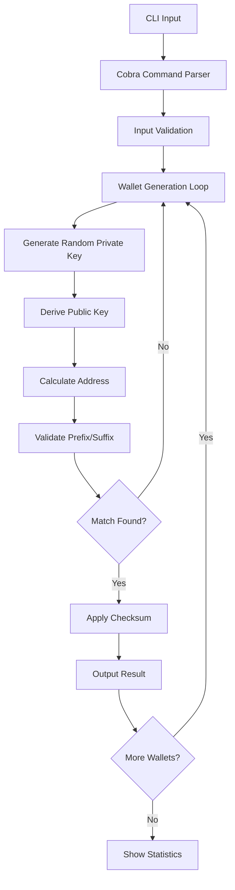

# Bloco Wallet Generator

A high-performance CLI tool for generating Ethereum bloco wallets with custom prefixes and suffixes, built in Go using the Cobra framework.

## Features

- ✨ Generate Ethereum wallets with custom prefix and/or suffix
- 🔐 Support for checksum validation (EIP-55)
- 📊 Real-time progress tracking with statistics
- 📈 Detailed difficulty analysis and time estimates  
- ⚡ High-performance implementation using Go
- 🎯 Multiple wallet generation in a single run
- 🏁 Performance benchmarking tools
- 📐 Probability calculations and success predictions

## Installation

### Prerequisites

- Go 1.21 or higher
- Git

### Build from Source

```bash
# Clone the repository
git clone <repository-url>
cd bloco-ethereum-wallet-generator

# Initialize Go module and download dependencies
go mod init bloco-eth
go mod tidy

# Build the application
go build -o bloco-eth main.go

# (Optional) Install globally
go install
```

### Using Makefile

```bash
# Initialize and build
make init
make build

# Run tests
make test

# Build for all platforms
make build-all
```

## Usage

### Basic Commands

#### Generate Bloco Wallets

```bash
# Generate a wallet with prefix 'abc'
./bloco-eth --prefix abc

# Generate a wallet with suffix '123'
./bloco-eth --suffix 123

# Generate a wallet with both prefix and suffix
./bloco-eth --prefix abc --suffix 123

# Generate 5 wallets with prefix 'dead'
./bloco-eth --prefix dead --count 5

# Generate with checksum validation (case-sensitive)
./bloco-eth --prefix DeaD --checksum

# Show detailed progress during generation
./bloco-eth --prefix abcd --progress --count 5
```

#### Analyze Pattern Difficulty

```bash
# Analyze difficulty for a specific pattern
./bloco-eth stats --prefix abc --suffix 123

# Analyze with checksum validation
./bloco-eth stats --prefix DeAdBeEf --checksum

# Check difficulty for just a prefix
./bloco-eth stats --prefix deadbeef
```

#### Performance Benchmarking

```bash
# Run benchmark with default settings (10,000 attempts)
./bloco-eth benchmark

# Custom benchmark with specific pattern
./bloco-eth benchmark --attempts 50000 --pattern "fffff"

# Benchmark with checksum validation
./bloco-eth benchmark --attempts 25000 --pattern "abc" --checksum
```

### Command Line Options

#### Main Generation Command

| Flag | Short | Description | Default |
|------|-------|-------------|---------|
| `--prefix` | `-p` | Prefix for the bloco address (hex only) | "" |
| `--suffix` | `-s` | Suffix for the bloco address (hex only) | "" |
| `--count` | `-c` | Number of wallets to generate | 1 |
| `--checksum` | | Enable EIP-55 checksum validation | false |
| `--progress` | | Show detailed progress during generation | false |

#### Statistics Command

| Flag | Short | Description |
|------|-------|-------------|
| `--prefix` | `-p` | Prefix for difficulty analysis |
| `--suffix` | `-s` | Suffix for difficulty analysis |
| `--checksum` | | Include checksum complexity in analysis |

#### Benchmark Command

| Flag | Short | Description | Default |
|------|-------|-------------|---------|
| `--attempts` | `-a` | Number of attempts for benchmark | 10000 |
| `--pattern` | `-p` | Pattern to use for benchmark | "fffff" |
| `--checksum` | | Enable checksum validation | false |

## Examples and Output

### Generate a Simple Bloco Wallet

```bash
./bloco-eth --prefix cafe --suffix beef --progress
```

Output:
```
🎯 Bloco Wallet Generator
═══════════════════════════════════════════════════════════════
🔧 Configuration:
   • Pattern: cafe****************************beef
   • Checksum: false
   • Count: 1 wallets
   • Progress: true

📊 Difficulty Analysis:
   • Difficulty: 16 777 216
   • 50% probability: 11 629 080 attempts
   • Estimated time (50% chance): ~3m52s
═══════════════════════════════════════════════════════════════

🔄 Generating wallet 1/1...

🎯 Generating bloco wallet with pattern: cafe****************************beef
📊 Difficulty: 16 777 216 | 50% probability: 11 629 080 attempts

[████████░░░░░░░░░░░░░░░░░░░░░░░░░░░░░░░░] 23.45% | 2 845 672 attempts | 48203 addr/s | Difficulty: 16 777 216 | ETA: 3m12s
✅ Success! Found matching address in 2 845 672 attempts

✅ Wallet 1 generated successfully!
   📍 Address:     0xCafe1234567890ABCDef1234567890ABCDefbeef
   🔑 Private Key: 0xa1b2c3d4e5f6789012345678901234567890abcdef1234567890abcdef123456
   🎲 Attempts:    2 845 672
   ⏱️  Time:        59.1s
   ⚡ Speed:       48203 addr/s
   📈 Probability: 23.45%

🏁 Generation Summary
═══════════════════════════════════════════════════════════════
✅ Successful wallets: 1/1
🎲 Total attempts: 2 845 672
⏱️  Total time: 59.1s
📊 Average attempts per wallet: 2845672
⚡ Overall speed: 48203 addr/s
🎯 Efficiency vs theoretical: 122.3%
═══════════════════════════════════════════════════════════════
```

### Difficulty Analysis

```bash
./bloco-eth stats --prefix deadbeef
```

Output:
```
📊 Bloco Address Difficulty Analysis
═══════════════════════════════════════════════════════════════
🎯 Pattern: deadbeef********************************
🔧 Checksum: false
📏 Pattern length: 8 characters

📈 Difficulty Metrics:
   • Base difficulty: 4 294 967 296
   • Total difficulty: 4 294 967 296
   • 50% probability: 2 977 044 471 attempts

⏱️  Time Estimates (at different speeds):
   • 1 000 addr/s: 34d 9h 37m 24.5s
   • 10 000 addr/s: 3d 10h 37m 44.7s
   • 50 000 addr/s: 16h 32m 32.9s
   • 100 000 addr/s: 8h 16m 16.4s

🎲 Probability Examples:
   • After 1 000 attempts: 0.0002%
   • After 10 000 attempts: 0.0023%
   • After 100 000 attempts: 0.0233%
   • After 1 000 000 attempts: 0.2326%

💡 Recommendations:
   • 💀 Extremely Hard - May take days/weeks/years
═══════════════════════════════════════════════════════════════
```

### Performance Benchmark

```bash
./bloco-eth benchmark --attempts 25000 --pattern "abc"
```

Output:
```
🚀 Starting benchmark with pattern 'abc' (checksum: false)
📈 Target: 25 000 attempts | Step size: 500

📊 500/25 000 (2.0%) | 51203 addr/s | Avg: 51203 addr/s
📊 1 000/25 000 (4.0%) | 49876 addr/s | Avg: 50540 addr/s
📊 1 500/25 000 (6.0%) | 52341 addr/s | Avg: 51140 addr/s
[... continues ...]
📊 25 000/25 000 (100.0%) | 48567 addr/s | Avg: 50245 addr/s

🏁 Benchmark completed!
═══════════════════════════════════════════════════════════════
📈 Total attempts: 25 000
⏱️  Total duration: 497ms
⚡ Average speed: 50245 addr/s
📊 Speed range: 47892 - 52341 addr/s
📏 Speed std dev: ±1205 addr/s
💻 Platform: Go go1.21+
═══════════════════════════════════════════════════════════════
```

## Architecture Overview



## Performance Considerations

### Complexity Analysis

The difficulty of finding a bloco address increases exponentially with the length of the desired prefix/suffix:

- **1 hex character**: ~16 attempts on average
- **2 hex characters**: ~256 attempts on average  
- **3 hex characters**: ~4,096 attempts on average
- **4 hex characters**: ~65,536 attempts on average
- **8 hex characters**: ~4.3 billion attempts on average

### Performance Tips

1. **Use shorter prefixes/suffixes** for faster generation
2. **Disable checksum validation** for better performance (use `--checksum` only when needed)
3. **Use progress flag** (`--progress`) for long-running generations
4. **Consider parallel processing** for multiple wallets

### Security Considerations

- ✅ Uses cryptographically secure random number generation
- ✅ Implements proper secp256k1 elliptic curve cryptography
- ✅ Supports EIP-55 checksum validation
- ✅ Private keys are generated using `crypto/rand`
- ⚠️ **Always verify generated addresses before use**
- ⚠️ **Keep private keys secure and never share them**

## Technical Implementation Details

### Core Components

1. **Cryptographic Functions**
   - secp256k1 elliptic curve operations via `github.com/ethereum/go-ethereum/crypto`
   - Keccak-256 hashing via `golang.org/x/crypto/sha3`
   - Secure random number generation via `crypto/rand`

2. **Address Derivation**
   - Private key (32 bytes) → Public key (64 bytes uncompressed)
   - Public key → Keccak256 hash → Last 20 bytes as address

3. **Checksum Validation (EIP-55)**
   - Calculate Keccak256 hash of lowercase address
   - Capitalize hex digits where corresponding hash digit ≥ 8

### Error Handling

The application includes comprehensive error handling for:
- Invalid hex characters in prefix/suffix
- Excessive prefix/suffix length combinations
- Cryptographic operation failures
- Random number generation failures

## Integration Examples

### Using as a Library

```go
package main

import (
    "fmt"
    "log"
)

func main() {
    // Generate a single bloco wallet
    result := generateBlocoWallet("abc", "123", false, false)
    if result.Error != "" {
        log.Fatal(result.Error)
    }
    
    fmt.Printf("Address: %s\n", result.Wallet.Address)
    fmt.Printf("Private Key: %s\n", result.Wallet.PrivKey)
    fmt.Printf("Attempts: %d\n", result.Attempts)
}
```

### API Integration

The core functions can be easily wrapped in an HTTP API:

```go
func handleGenerateWallet(w http.ResponseWriter, r *http.Request) {
    prefix := r.URL.Query().Get("prefix")
    suffix := r.URL.Query().Get("suffix")
    
    result := generateBlocoWallet(prefix, suffix, false, false)
    json.NewEncoder(w).Encode(result)
}
```

## Dependencies

- **github.com/spf13/cobra**: CLI framework
- **github.com/ethereum/go-ethereum/crypto**: Ethereum cryptographic functions
- **golang.org/x/crypto/sha3**: Keccak-256 hashing
- **crypto/rand**: Secure random number generation

## Contributing

1. Fork the repository
2. Create a feature branch (`git checkout -b feature/amazing-feature`)
3. Commit your changes (`git commit -m 'Add amazing feature'`)
4. Push to the branch (`git push origin feature/amazing-feature`)
5. Open a Pull Request

## License

This project is licensed under the MIT License - see the [LICENSE](LICENSE) file for details.

## Troubleshooting

### Common Issues

1. **"Invalid hex character" error**
   - Ensure prefix and suffix contain only valid hex characters (0-9, a-f, A-F)

2. **"Combined length cannot exceed 40 characters" error**
   - Ethereum addresses are 40 hex characters long
   - Reduce prefix + suffix total length to ≤ 40

3. **Slow generation**
   - Longer prefixes/suffixes take exponentially more time
   - Consider using shorter patterns or disabling checksum validation

4. **Build errors**
   - Ensure Go 1.21+ is installed
   - Run `go mod tidy` to resolve dependencies

### Performance Monitoring

Monitor generation performance using the built-in statistics:

```bash
# Long-running generation with progress
./bloco-eth --prefix abcdef --progress --count 1
```

For extremely long patterns, consider running on high-performance hardware or implementing distributed generation.