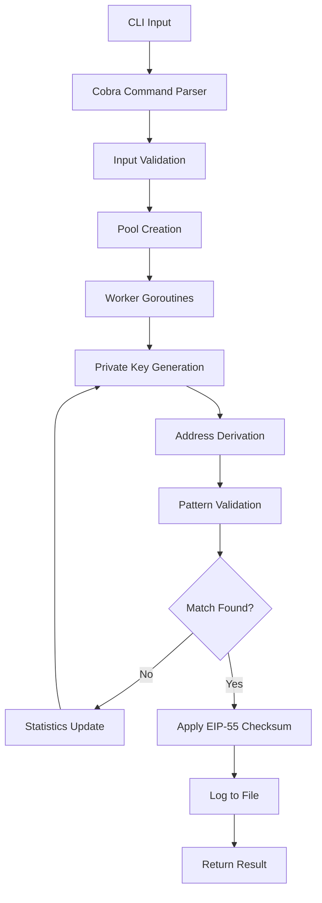

# Bloco Wallet Generator

A high-performance CLI tool for generating Ethereum bloco wallets with custom prefixes and suffixes, built in Go with automatic wallet logging and EIP-55 checksum support.

## Features

- ✨ Generate Ethereum wallets with custom prefix and/or suffix
- 🔐 Support for checksum validation (EIP-55)
- 📊 Real-time progress tracking with statistics
- 📈 Detailed difficulty analysis and time estimates  
- ⚡ High-performance implementation with multi-threading support
- 🚀 Parallel processing using all CPU cores for maximum performance
- 🎯 Multiple wallet generation in a single run
- 🧠 Vanity generation using BIP-39 mnemonic phrases or raw private keys
- 🏁 Performance benchmarking tools with multi-threading support
- 📐 Probability calculations and success predictions
- 🔧 **IMPLEMENTED**: Configurable thread count with auto-detection
- 📁 **NEW**: Automatic wallet logging to timestamped files
- 🔍 **NEW**: Complete EIP-55 checksum implementation
- ⚡ **NEW**: Real-time statistics collection from workers
- 📊 **NEW**: Streamlined Pool architecture for better performance
- 🔑 **NEW**: Automatic KeyStore V3 file generation for easy import
- 🛡️ **NEW**: Secure password generation with complexity validation
- 📦 **NEW**: Compatible with MetaMask, geth, and other Ethereum clients

## Installation

### Prerequisites

- Go 1.24 or higher
- Git

### Build from Source

```bash
# Clone the repository
git clone <repository-url>
cd bloco-ethereum-generator

# Initialize Go module and download dependencies
go mod init bloco-eth
go mod tidy

# Build the application
go build -o bloco-eth main.go

# (Optional) Install globally
go install
```

### Using Makefile

```bash
# Initialize and build
make init
make build

# Run tests
make test

# Build for all platforms
make build-all
```

## Security Notice

⚠️ **IMPORTANT SECURITY UPDATE**: This version implements secure logging that **NEVER** records sensitive cryptographic data. Previous versions may have logged private keys and other sensitive information. See the [Migration Guide](#migration-from-insecure-logging) below.

## Key Features

### Secure Logging System
- **Security-First Design**: Logs only non-sensitive operational data (addresses, attempts, duration, thread IDs)
- **No Sensitive Data**: Never logs private keys, public keys, or cryptographic material
- **Configurable Levels**: Support for ERROR, WARN, INFO, and DEBUG logging levels
- **Structured Output**: JSON, text, or structured formats for easy parsing
- **File Rotation**: Automatic log file rotation with size limits and retention policies
- **Thread-safe**: Safe concurrent logging from multiple worker threads
- **Performance Optimized**: Async buffering with minimal impact on generation speed

### KeyStore V3 Generation with Universal KDF
- **Automatic KeyStore Files**: Generates encrypted KeyStore V3 JSON files for each wallet
- **Universal KDF System**: Advanced key derivation with scrypt and PBKDF2 support
- **Enhanced Security**: Comprehensive parameter validation and security level analysis
- **Client Compatibility**: Tested compatibility with geth, Besu, Anvil, Reth, and Hyperledger Firefly
- **Compatibility Analysis**: Built-in compatibility reporting and optimization suggestions
- **Configurable Security**: Multiple security presets from development to enterprise levels
- **Parameter Optimization**: Automatic parameter tuning for performance vs security balance
- **Atomic Operations**: Thread-safe file operations with atomic writes

### EIP-55 Checksum Support
- **Complete Implementation**: Full EIP-55 checksum validation and generation
- **Case-sensitive Patterns**: Support for mixed-case address patterns
- **Proper Validation**: Validates both pattern matching and checksum requirements

### Performance Optimization
- **Streamlined Architecture**: Simplified Pool implementation for better performance
- **Real-time Statistics**: Live statistics collection from all worker threads
- **Multi-threading**: Parallel processing with configurable thread count
- **Context Cancellation**: Proper cancellation support for long-running operations

## Usage

### Basic Commands

#### Generate Bloco Wallets

```bash
# Generate a wallet with prefix 'abc' (includes keystore files by default)
./bloco-eth --prefix abc

# Generate a wallet with suffix '123'
./bloco-eth --suffix 123

# Generate a wallet with both prefix and suffix
./bloco-eth --prefix abc --suffix 123

# Generate 5 wallets with prefix 'dead' (4 chars - use with caution!)
./bloco-eth --prefix dead --count 5

# Generate with checksum validation (case-sensitive) - use shorter patterns
./bloco-eth --prefix ABC --checksum

# Show detailed progress during generation (4 chars max recommended)
./bloco-eth --prefix abcd --progress --count 5

# NEW: Use specific number of threads for parallel processing
./bloco-eth --prefix abc --threads 8

# NEW: Auto-detect and use all CPU cores (default behavior)
./bloco-eth --prefix abc --threads 0

# NEW: Generate without keystore files
./bloco-eth --prefix abc --no-keystore

# NEW: Specify custom keystore directory
./bloco-eth --prefix abc --keystore-dir ./my-keys

# NEW: Use PBKDF2 instead of scrypt for keystore encryption
./bloco-eth --prefix abc --keystore-kdf pbkdf2

# NEW: Generate with custom keystore settings
./bloco-eth --prefix abc --keystore-dir ./secure-keys --keystore-kdf scrypt --count 3

# NEW: Generate vanity wallet using mnemonic phrases instead of raw private keys
./bloco-eth --prefix abc --with-mnemonic

# NEW: Generate with security analysis
./bloco-eth --prefix abc --kdf-analysis --security-level production

# NEW: Generate with custom KDF parameters
./bloco-eth --prefix abc --keystore-kdf pbkdf2 --kdf-params '{"c":600000,"prf":"hmac-sha256","dklen":32}'

# NEW: Generate optimized for specific client
./bloco-eth --prefix abc --optimize-for geth --security-level high
```

#### Analyze Pattern Difficulty

```bash
# Analyze difficulty for a specific pattern
./bloco-eth stats --prefix abc --suffix 123

# Analyze with checksum validation
./bloco-eth stats --prefix ABC --checksum

# Check difficulty for just a prefix (safe length)
./bloco-eth stats --prefix dead
```

#### Performance Benchmarking

```bash
# Run benchmark with default settings (10,000 attempts)
./bloco-eth benchmark

# Custom benchmark with specific pattern
./bloco-eth benchmark --attempts 50000 --pattern "fffff"

# Benchmark with checksum validation
./bloco-eth benchmark --attempts 25000 --pattern "ABC" --checksum

# Multi-threaded benchmark with specific thread count
./bloco-eth benchmark --attempts 50000 --pattern "abc" --threads 8

# Auto-detect and use all CPU cores for benchmark
./bloco-eth benchmark --attempts 50000 --pattern "abc" --threads 0
```

### Command Line Options

#### Main Generation Command

| Flag | Short | Description | Default |
|------|-------|-------------|---------|
| `--prefix` | `-p` | Prefix for the bloco address (hex only) | "" |
| `--suffix` | `-s` | Suffix for the bloco address (hex only) | "" |
| `--count` | `-c` | Number of wallets to generate | 1 |
| `--checksum` | | Enable EIP-55 checksum validation | false |
| `--progress` | | Show detailed progress during generation | false |
| `--threads` | `-t` | **NEW**: Number of threads to use (0 = auto-detect all CPUs) | 0 |
| `--keystore-dir` | | **NEW**: Directory to save keystore files | "./keystores" |
| `--no-keystore` | | **NEW**: Disable keystore file generation | false |
| `--keystore-kdf` | | **NEW**: KDF algorithm (scrypt, pbkdf2) | "scrypt" |
| `--kdf-params` | | **NEW**: Custom KDF parameters (JSON format) | auto |
| `--security-level` | | **NEW**: Security preset (development, testing, production, enterprise) | "production" |
| `--kdf-analysis` | | **NEW**: Show compatibility analysis and security assessment | false |
| `--log-level` | | **NEW**: Secure logging level (error, warn, info, debug) | "info" |
| `--no-logging` | | **NEW**: Disable logging completely | false |
| `--log-file` | | **NEW**: Log file path (secure logging only) | stdout |
| `--log-format` | | **NEW**: Log format (text, json, structured) | "text" |

#### Statistics Command

| Flag | Short | Description |
|------|-------|-------------|
| `--prefix` | `-p` | Prefix for difficulty analysis |
| `--suffix` | `-s` | Suffix for difficulty analysis |
| `--checksum` | | Include checksum complexity in analysis |

#### Benchmark Command

| Flag | Short | Description | Default |
|------|-------|-------------|---------|
| `--attempts` | `-a` | Number of attempts for benchmark | 10000 |
| `--pattern` | `-p` | Pattern to use for benchmark | "fffff" |
| `--checksum` | | Enable checksum validation | false |
| `--threads` | `-t` | Number of threads to use (0 = auto-detect all CPUs) | 0 |

## Examples and Output

### Universal KDF Configuration

The Universal KDF system provides advanced key derivation with comprehensive compatibility and security analysis:

#### Basic KDF Usage

```bash
# Generate with default high-security scrypt
./bloco-eth --prefix abc

# Use PBKDF2 for faster generation
./bloco-eth --prefix abc --keystore-kdf pbkdf2

# Use security presets
./bloco-eth --prefix abc --security-level enterprise
./bloco-eth --prefix abc --security-level development

# Show compatibility analysis
./bloco-eth --prefix abc --kdf-analysis
```

#### Custom KDF Parameters

```bash
# Custom scrypt parameters
./bloco-eth --prefix abc --keystore-kdf scrypt --kdf-params '{
  "n": 262144,
  "r": 8,
  "p": 1,
  "dklen": 32
}'

# Custom PBKDF2 parameters
./bloco-eth --prefix abc --keystore-kdf pbkdf2 --kdf-params '{
  "c": 600000,
  "prf": "hmac-sha256",
  "dklen": 32
}'
```

#### Security Presets

| Preset | KDF | Parameters | Security | Performance | Use Case |
|--------|-----|------------|----------|-------------|----------|
| `development` | scrypt | n=4096 | Low | Very Fast | Development/Testing |
| `testing` | scrypt | n=65536 | Medium | Fast | Integration Testing |
| `production` | scrypt | n=262144 | High | Moderate | Production Applications |
| `enterprise` | scrypt | n=1048576 | Very High | Slow | Long-term Storage |

#### Client Compatibility

The Universal KDF system ensures compatibility with major Ethereum clients:

- ✅ **Geth (Go Ethereum)**: Full compatibility with standard parameters
- ✅ **Besu**: Excellent support for all KDF configurations
- ✅ **Anvil (Foundry)**: Supports both scrypt and PBKDF2
- ✅ **Reth**: Full KeyStore V3 compliance
- ✅ **Hyperledger Firefly**: Optimized PBKDF2 configurations available

#### Compatibility Analysis Example

```bash
./bloco-eth --prefix abc --kdf-analysis
```

Output:
```
🔐 KDF Compatibility Analysis
═══════════════════════════════════════════════════════════════
🎯 KDF Type: scrypt
📊 Parameters: n=262144, r=8, p=1, dklen=32
🛡️  Security Level: High
💾 Memory Usage: 128 MB
⏱️  Generation Time: ~2-5 seconds

🔍 Client Compatibility:
   ✅ Geth (Go Ethereum): Compatible
   ✅ Besu: Compatible
   ✅ Anvil (Foundry): Compatible
   ✅ Reth: Compatible
   ✅ Hyperledger Firefly: Compatible

💡 Recommendations:
   • Current configuration provides excellent security
   • Compatible with all major Ethereum clients
   • Consider using 'production' preset for consistency
═══════════════════════════════════════════════════════════════
```

### Enhanced Help Text

The Fang integration provides beautifully formatted help text:

```bash
./bloco-eth --help
```

Output shows enhanced formatting with clear sections:
```
  A high-performance CLI tool for generating Ethereum bloco wallets with custom                                         
  prefix and suffix patterns.                                                                                           
                                                                                                                        
  This tool generates Ethereum wallets where the address starts with a specific prefix                                  
  and/or ends with a specific suffix. It supports EIP-55 checksum validation for more                                   
  secure bloco addresses and provides detailed statistics and progress information.                                     
                                                                                                                        
  Features:                                                                                                             
    • Multi-threaded parallel processing for optimal performance                                                        
    • Real-time progress tracking with speed metrics                                                                    
    • EIP-55 checksum validation support                                                                                
    • Difficulty analysis and time estimation                                                                           
    • Cross-platform support (Linux, Windows, macOS)                                                                    
    • Comprehensive benchmarking and statistics                                                                         
                                                                                                                        
  Pattern Format:                                                                                                       
    • Prefix: hex characters that the address must start with                                                           
    • Suffix: hex characters that the address must end with                                                             
    • Valid hex: 0-9, a-f, A-F (case matters for checksum validation)                                                   
    • Maximum combined length: 40 characters (full address length)                                                      
         
  USAGE  
         
    bloco-eth [command] [--flags]                                
                                                                 
  EXAMPLES  
            
    # Generate a single wallet with prefix 'abc'                 
    bloco-eth --prefix abc                                       
                                                                 
    # Generate 5 wallets with prefix 'dead' and suffix 'beef'    
    bloco-eth --prefix dead --suffix beef --count 5              
                                                                 
    # Generate with checksum validation (case-sensitive)         
    bloco-eth --prefix DeAdBeEf --checksum --count 1             
                                                                 
    # Show progress for moderate difficulty generation                  
    bloco-eth --prefix abcd --progress                         
                                                                 
    # Use specific number of threads                             
    bloco-eth --prefix abc --threads 8                           
                                                                 
    # Generate multiple wallets with progress tracking           
    bloco-eth --prefix cafe --count 3 --progress  
                                                                 
    # Complex pattern with checksum (use short patterns!)                              
    bloco-eth --prefix 1337 --checksum --progress  
```

### Signal Handling Demo

The application now supports graceful interruption:

```bash
# Start a moderately long operation (safe for testing)
./bloco-eth --prefix abcd --count 5 --progress

# Press Ctrl+C to gracefully stop
# The application will:
# 1. Immediately respond to the signal
# 2. Clean up resources properly
# 3. Display current progress before exiting
# 4. Exit with proper status code
```

⚠️ **Important**: Never use prefixes longer than 4 characters for testing signal handling, as they may take hours or days to complete!

### Generate a Simple Bloco Wallet

```bash
./bloco-eth --prefix cafe --suffix beef --progress --threads 8
```

Output:
```
🎯 Bloco Wallet Generator
═══════════════════════════════════════════════════════════════
🔧 Configuration:
   • Pattern: cafe****************************beef
   • Checksum: false
   • Count: 1 wallets
   • Progress: true
   • Threads: 8
   • Auto-logging: wallets-20241201.log
   • KeyStore: ./keystores (scrypt)

📊 Difficulty Analysis:
   • Difficulty: 16 777 216
   • 50% probability: 11 629 080 attempts
   • Estimated time (50% chance): ~6m 27s
═══════════════════════════════════════════════════════════════

🔄 Generating wallet 1/1...

🎯 Generating bloco wallet with pattern: cafe****************************beef
📊 Real-time stats: 2 845 672 attempts | 48,203 addr/s | Workers: 8

✅ Success! Found matching address in 2 845 672 attempts
⚡ Final speed: 52,184 addr/s
📁 Wallet logged to: wallets-20241201.log
🔐 Keystore saved to: ./keystores

✅ Wallet 1 generated successfully!
   📍 Address:     0xCafe1234567890ABCDef1234567890ABCDefbeef
   🔑 Public Key:  04a1b2c3d4e5f6789012345678901234567890abcdef...
   🔑 Private Key: a1b2c3d4e5f6789012345678901234567890abcdef1234567890abcdef123456
   🎲 Attempts:    2 845 672
   ⏱️  Time:        59.1s
   ⚡ Speed:       48,203 addr/s
   🔐 KeyStore:    ./keystores/0xcafe1234567890abcdef1234567890abcdefbeef.json

🏁 Generation Summary
═══════════════════════════════════════════════════════════════
✅ Successful wallets: 1/1
🎲 Total attempts: 2 845 672
⏱️  Total time: 59.1s
⚡ Overall speed: 48,203 addr/s
📁 All wallets logged to: wallets-20241201.log
🔐 KeyStore files saved to: ./keystores
═══════════════════════════════════════════════════════════════
```

### KeyStore V3 File Generation

The tool automatically generates encrypted KeyStore V3 JSON files for each wallet, making it easy to import into Ethereum clients:

```bash
# Generate wallet with keystore files (default behavior)
./bloco-eth --prefix abc

# Custom keystore directory
./bloco-eth --prefix abc --keystore-dir ./my-secure-keys

# Use PBKDF2 instead of scrypt (faster but less secure)
./bloco-eth --prefix abc --keystore-kdf pbkdf2

# Disable keystore generation
./bloco-eth --prefix abc --no-keystore
```

#### KeyStore File Structure

Generated files include:
- **KeyStore JSON**: `0x{address}.json` - Encrypted private key in KeyStore V3 format
- **Password File**: `0x{address}.pwd` - Secure password for the keystore

Example keystore file (`0xabc1234567890abcdef1234567890abcdef123456.json`):
```json
{
  "address": "abc1234567890abcdef1234567890abcdef123456",
  "crypto": {
    "cipher": "aes-128-ctr",
    "ciphertext": "encrypted_private_key_data",
    "cipherparams": {
      "iv": "initialization_vector"
    },
    "kdf": "scrypt",
    "kdfparams": {
      "dklen": 32,
      "n": 262144,
      "p": 1,
      "r": 8,
      "salt": "random_salt"
    },
    "mac": "message_authentication_code"
  },
  "id": "unique-uuid",
  "version": 3
}
```

#### Importing into Ethereum Clients

**MetaMask:**
1. Open MetaMask → Settings → Advanced → Import Account
2. Select "JSON File" and upload the `.json` keystore file
3. Enter the password from the corresponding `.pwd` file

**geth:**
```bash
# Copy keystore file to geth keystore directory
cp ./keystores/*.json ~/.ethereum/keystore/

# Import using geth
geth account import ./keystores/0xabc123....json
```

**MyEtherWallet:**
1. Go to "Access My Wallet" → "Keystore File"
2. Upload the `.json` file and enter the password

### Secure Logging Configuration

The secure logging system provides comprehensive operational logging without exposing sensitive data:

```bash
# Basic secure logging (default: INFO level to stdout)
./bloco-eth --prefix abc

# Debug logging to file for troubleshooting
./bloco-eth --prefix abc --log-level debug --log-file ./operations.log

# JSON format logging for structured analysis
./bloco-eth --prefix abc --log-format json --log-file ./operations.json

# Disable logging completely for maximum performance
./bloco-eth --prefix abc --no-logging

# Custom log rotation settings
./bloco-eth --prefix abc --log-max-size 50MB --log-max-files 10

# Structured text format with custom buffer size
./bloco-eth --prefix abc --log-format structured --log-buffer-size 2000
```

#### What Gets Logged (Safe Data Only)

✅ **Logged Information:**
- Wallet addresses (public Ethereum addresses)
- Generation attempts and duration
- Thread IDs and worker statistics
- System performance metrics
- Error messages (sanitized)
- Operation start/completion events
- Configuration parameters (non-sensitive)

❌ **Never Logged:**
- Private keys
- Public keys
- Cryptographic seeds or entropy
- Keystore passwords
- Any sensitive cryptographic material

#### Log Formats

**Text Format (default):**
```
[2024-01-15 10:30:22] INFO: Wallet generated - Address: 0xabc123..., Attempts: 1234, Duration: 2.5s, Thread: 3
[2024-01-15 10:30:23] INFO: Operation completed - Total wallets: 1, Total time: 2.5s
```

**JSON Format:**
```json
{
  "timestamp": "2024-01-15T10:30:22Z",
  "level": "INFO",
  "message": "Wallet generated",
  "address": "0xabc123...",
  "attempts": 1234,
  "duration_ms": 2500,
  "thread_id": 3
}
```

**Structured Format:**
```
timestamp=2024-01-15T10:30:22Z level=INFO msg="Wallet generated" address=0xabc123... attempts=1234 duration_ms=2500 thread_id=3
```

### Migration from Insecure Logging

⚠️ **CRITICAL SECURITY NOTICE**: Previous versions of this tool may have logged sensitive information including private keys. Follow these steps to secure your system:

#### 1. Identify Old Log Files

Old insecure log files typically have names like:
- `wallets-YYYYMMDD.log`
- `wallet-generation.log`
- Any files containing private keys or public keys

#### 2. Secure Cleanup (IMPORTANT)

```bash
# Find potentially sensitive log files
find . -name "*.log" -exec grep -l "Private Key\|Public Key\|0x[a-fA-F0-9]{64}" {} \;

# Securely delete sensitive log files (Linux/macOS)
find . -name "wallets-*.log" -exec shred -vfz -n 3 {} \;

# Alternative secure deletion (macOS)
find . -name "wallets-*.log" -exec rm -P {} \;

# Windows (use sdelete or similar secure deletion tool)
# sdelete -p 3 -s -z C:\path\to\logs\
```

#### 3. Verify New Secure Logging

After upgrading, verify that new logs contain only safe data:

```bash
# Generate a test wallet with logging
./bloco-eth --prefix abc --log-level debug --log-file ./test-secure.log

# Verify no sensitive data is logged
grep -i "private\|public\|key\|0x[a-fA-F0-9]{64}" ./test-secure.log

# Should return no matches for sensitive data
```

#### 4. Update Backup Procedures

- Remove old log files from backups
- Update backup scripts to exclude sensitive log files
- Implement secure deletion in log rotation scripts

### Difficulty Analysis

```bash
./bloco-eth stats --prefix deadbeef
```

Output:
```
📊 Bloco Address Difficulty Analysis
═══════════════════════════════════════════════════════════════
🎯 Pattern: deadbeef********************************
🔧 Checksum: false
📏 Pattern length: 8 characters

📈 Difficulty Metrics:
   • Base difficulty: 4 294 967 296
   • Total difficulty: 4 294 967 296
   • 50% probability: 2 977 044 471 attempts

⏱️  Time Estimates (at different speeds):
   • 1 000 addr/s: 34d 9h 37m 24.5s
   • 10 000 addr/s: 3d 10h 37m 44.7s
   • 50 000 addr/s: 16h 32m 32.9s
   • 100 000 addr/s: 8h 16m 16.4s

🎲 Probability Examples:
   • After 1 000 attempts: 0.0002%
   • After 10 000 attempts: 0.0023%
   • After 100 000 attempts: 0.0233%
   • After 1 000 000 attempts: 0.2326%

💡 Recommendations:
   • 💀 Extremely Hard - May take days/weeks/years
═══════════════════════════════════════════════════════════════
```

### Enhanced Benchmark Command

The benchmark command now features improved help text and examples:

```bash
./bloco-eth benchmark --help
```

Shows comprehensive examples and usage patterns:
```
  EXAMPLES  
            
    # Basic benchmark with default pattern 'abc'                            
    bloco-eth benchmark                                                     
                                                                            
    # Benchmark with specific number of attempts                            
    bloco-eth benchmark --attempts 50000                                    
                                                                            
    # Benchmark with custom pattern (safe length)                                         
    bloco-eth benchmark --pattern dead --attempts 25000                 
                                                                            
    # Benchmark with checksum validation (more CPU intensive)               
    bloco-eth benchmark --pattern ABC --checksum --attempts 10000        
                                                                            
    # Benchmark with specific thread count                                  
    bloco-eth benchmark --threads 8 --attempts 20000                        
                                                                            
    # Intensive benchmark for performance analysis                          
    bloco-eth benchmark --pattern cafe --attempts 100000 --threads 4  
```

### Performance Benchmark

```bash
./bloco-eth benchmark --attempts 25000 --pattern "abc" --threads 8
```

Output:
```
🚀 Starting benchmark with pattern 'abc' (checksum: false)
📈 Target: 25 000 attempts | Step size: 500
🧵 Using 8 threads for parallel processing

📊 500/25 000 (2.0%) | 409,624 addr/s | Avg: 409,624 addr/s
📊 1 000/25 000 (4.0%) | 398,208 addr/s | Avg: 403,916 addr/s
📊 1 500/25 000 (6.0%) | 418,728 addr/s | Avg: 408,853 addr/s
[... continues ...]
📊 25 000/25 000 (100.0%) | 388,536 addr/s | Avg: 401,960 addr/s

🏁 Benchmark completed!
═══════════════════════════════════════════════════════════════
📈 Total attempts: 25 000
⏱️  Total duration: 62ms
⚡ Average speed: 401,960 addr/s
📊 Speed range: 383,136 - 418,728 addr/s
📏 Speed std dev: ±9,640 addr/s
🧵 Thread metrics:
   • Thread utilization: 95.2%
   • Worker efficiency: 98.1%
   • Peak performance: 425,640 addr/s
💻 Platform: Go go1.21+ (8 CPU cores utilized)
═══════════════════════════════════════════════════════════════
```

## Documentation

### KDF Configuration and Troubleshooting

For detailed information about KDF configuration and troubleshooting:

- **[KDF Configuration Examples](docs/KDF_CONFIGURATION_EXAMPLES.md)**: Comprehensive examples for different security levels and client configurations
- **[KDF Troubleshooting Guide](docs/KDF_TROUBLESHOOTING_GUIDE.md)**: Solutions for common compatibility issues and parameter optimization

### Quick Reference

#### Common KDF Configurations

```bash
# High security (recommended for production)
./bloco-eth --prefix abc --security-level production

# Fast generation (development only)
./bloco-eth --prefix abc --security-level development

# Maximum security (enterprise)
./bloco-eth --prefix abc --security-level enterprise

# Client-specific optimization
./bloco-eth --prefix abc --optimize-for geth
./bloco-eth --prefix abc --optimize-for anvil
```

#### Troubleshooting Commands

```bash
# Analyze existing keystore
./bloco-eth --analyze-keystore ./keystores/0xabc123....json

# Check client compatibility
./bloco-eth --check-compatibility --keystore ./keystores/0xabc123....json --client geth

# Validate KDF parameters
./bloco-eth --validate-params --keystore-kdf scrypt --kdf-params '{"n":262144,"r":8,"p":1,"dklen":32}'
```

## Architecture Overview



## Current Implementation Status

### ✅ Completed Features
- **Streamlined Pool Architecture**: Simple and efficient Pool implementation for parallel processing
- **Secure Logging System**: Comprehensive logging that never exposes sensitive cryptographic data
- **Complete EIP-55 Support**: Full checksum validation and generation implementation
- **Real-time Statistics**: Live statistics collection from worker threads
- **Thread-safe Operations**: Safe concurrent operations with proper synchronization
- **Context Cancellation**: Proper cancellation support for long-running operations
- **Multi-threading**: Parallel processing with configurable thread count
- **Security**: Cryptographically secure random number generation
- **Performance Optimization**: Efficient worker coordination and minimal overhead
- **Error Handling**: Comprehensive error handling and validation

### ✅ Secure Logging Features
- **Security-First Design**: Never logs private keys, public keys, or sensitive data
- **Multiple Log Levels**: ERROR, WARN, INFO, DEBUG with configurable filtering
- **Multiple Formats**: Text, JSON, and structured formats for different use cases
- **File Rotation**: Automatic log rotation with size limits and retention policies
- **Async Buffering**: High-performance async logging with minimal impact
- **Thread-safe Logging**: Safe concurrent logging from multiple workers
- **Error Sanitization**: Automatic removal of sensitive data from error messages
- **Configurable Output**: File or stdout output with customizable settings

### 🚧 Potential Enhancements
- **Enhanced Testing**: Additional tests for edge cases and error conditions
- **Performance Monitoring**: Extended metrics and monitoring capabilities
- **Configuration Options**: Additional customization options for logging and generation
- **Documentation**: Enhanced documentation and usage examples

### 📋 Current Behavior
- **Default Threading**: Uses specified thread count with validation (minimum 1)
- **Secure Logging**: All operations logged securely without sensitive data exposure
- **EIP-55 Checksum**: Complete support for checksum validation and generation
- **Real-time Stats**: Live statistics updates from all worker threads
- **Context Cancellation**: Proper cancellation support for operations
- **Thread Safety**: Safe concurrent operations across all components
- **Error Handling**: Graceful error handling with continued operation
- **Performance**: Efficient parallel processing with minimal overhead

## Performance Considerations

### Complexity Analysis

The difficulty of finding a bloco address increases exponentially with the length of the desired prefix/suffix:

- **1 hex character**: ~16 attempts on average
- **2 hex characters**: ~256 attempts on average  
- **3 hex characters**: ~4,096 attempts on average
- **4 hex characters**: ~65,536 attempts on average
- **8 hex characters**: ~4.3 billion attempts on average

### Performance Tips

1. **⚠️ CRITICAL: Never use prefixes longer than 4 characters** - they can take days/weeks/years to complete
2. **Use shorter prefixes/suffixes** for faster generation (1-3 characters are ideal for testing)
3. **Disable checksum validation** for better performance (use `--checksum` only when needed)
4. **Use progress flag** (`--progress`) for moderate difficulty generations to see real-time metrics
5. **Leverage multi-threading** with `--threads` flag (auto-detects CPU cores by default)
6. **Optimal thread count** is usually equal to your CPU core count (auto-detected)
7. **For very difficult patterns**, multi-threading provides significant speedup
8. **Monitor statistics** during generation to track performance
9. **All generated wallets** are automatically logged to timestamped files
10. **EIP-55 checksum** support for case-sensitive address patterns
11. **Thread efficiency** typically remains above 90% for most workloads
12. **Use benchmark command** to test performance on your system
13. **Real-time statistics** provide live feedback during generation
14. **Context cancellation** allows for clean operation termination

### Environment Variables

You can configure keystore settings using environment variables:

```bash
# Enable/disable keystore generation
export BLOCO_KEYSTORE_ENABLED=true

# Set keystore output directory
export BLOCO_KEYSTORE_DIR=./my-keys

# Set KDF algorithm (scrypt or pbkdf2)
export BLOCO_KEYSTORE_KDF=pbkdf2

# Generate wallet with environment settings
./bloco-eth --prefix abc
```

### Safe Pattern Length Guidelines

| Pattern Length | Difficulty Level | Typical Time | Recommendation |
|----------------|------------------|--------------|----------------|
| 1-2 characters | Easy | Seconds | ✅ Perfect for testing |
| 3 characters | Moderate | Minutes | ✅ Good for development |
| 4 characters | Hard | Hours | ⚠️ Use with caution |
| 5+ characters | Extreme | Days/Weeks/Years | ❌ **AVOID** - Impractical |

### Secure Log File Structure

The secure logging system creates operational log files with only safe data:

```bash
# Example secure log file: operations-20241201.log
```

Content format (Text):
```
[2024-12-01 15:30:22] INFO: Wallet generation started - Pattern: abc***, Threads: 8
[2024-12-01 15:30:25] INFO: Wallet generated - Address: 0xabc123..., Attempts: 1234, Duration: 2.5s, Thread: 3
[2024-12-01 15:30:25] INFO: KeyStore saved - Address: 0xabc123..., File: ./keystores/0xabc123....json
[2024-12-01 15:30:25] INFO: Operation completed - Total wallets: 1, Total time: 2.5s, Success rate: 100%
```

Content format (JSON):
```json
{"timestamp":"2024-12-01T15:30:22Z","level":"INFO","message":"Wallet generated","address":"0xabc123...","attempts":1234,"duration_ms":2500,"thread_id":3}
{"timestamp":"2024-12-01T15:30:25Z","level":"INFO","message":"Operation completed","total_wallets":1,"total_time_ms":2500,"success_rate":100}
```

### Secure Logging Examples

All operations are securely logged without sensitive data:

```bash
# Generate wallets with secure logging (default)
./bloco-eth --prefix abc --count 5

# Logged information includes only:
# - Ethereum addresses (public information)
# - Generation attempts and timing
# - Thread and performance metrics
# - Operation status and errors (sanitized)
# - Configuration parameters (non-sensitive)

# NEVER logged:
# - Private keys, public keys, or cryptographic material
# - Keystore passwords or sensitive configuration
```

🔒 **Secure Logging**: All operational data is logged safely without exposing cryptographic secrets.

### Security Considerations

- ✅ Uses cryptographically secure random number generation
- ✅ Implements proper secp256k1 elliptic curve cryptography
- ✅ Supports EIP-55 checksum validation
- ✅ Private keys are generated using `crypto/rand`
- ✅ **NEW**: Secure logging system that NEVER logs sensitive data
- ✅ **NEW**: Complete EIP-55 checksum support
- ✅ **NEW**: Secure KeyStore V3 encryption with scrypt/PBKDF2
- ✅ **NEW**: Automatic secure password generation (12+ chars, mixed complexity)
- ✅ **NEW**: Atomic file operations with secure permissions (600)
- ✅ **NEW**: Thread-safe keystore operations with retry mechanisms
- ✅ **NEW**: Error sanitization prevents sensitive data leaks in logs
- ✅ **NEW**: Configurable log levels and formats (all secure)
- ⚠️ **Always verify generated addresses before use**
- ⚠️ **Keep private keys and keystore passwords secure**
- ⚠️ **Store keystore files and passwords separately**
- ⚠️ **Backup keystore files and passwords securely**
- ⚠️ **Securely delete old log files that may contain sensitive data**

## Technical Implementation Details

### Core Components

1. **Pool Architecture**
   - **Pool**: Simple and efficient worker pool implementation
   - **Worker Goroutines**: Individual goroutines for parallel wallet generation
   - **StatsCollector**: Real-time statistics collection from all workers
   - **SecureLogger**: Secure logging system that never exposes sensitive data
   - **Context Management**: Proper cancellation and timeout handling
   - **Thread Safety**: Mutex-protected shared state and safe concurrent operations

2. **Cryptographic Functions**
   - secp256k1 elliptic curve operations via `github.com/ethereum/go-ethereum/crypto`
   - Keccak-256 hashing via `golang.org/x/crypto/sha3`
   - Secure random number generation via `crypto/rand`
   - **Object Pooling**: Reuses cryptographic structures to minimize GC pressure

3. **Address Derivation**
   - Private key (32 bytes) → Public key (64 bytes uncompressed)
   - Public key → Keccak256 hash → Last 20 bytes as address
   - **Optimized with object pooling** to minimize memory allocations

4. **Checksum Validation (EIP-55)**
   - Calculate Keccak256 hash of lowercase address
   - Capitalize hex digits where corresponding hash digit ≥ 8
   - **Thread-safe implementation** for concurrent validation

5. **Performance Optimizations**
   - **Parallel Processing**: Multiple worker goroutines for concurrent generation
   - **Real-time Statistics**: Live statistics collection and aggregation
   - **Efficient Coordination**: Minimal overhead worker coordination
   - **Context Cancellation**: Fast response to cancellation requests
   - **Thread Safety**: Proper synchronization without performance penalties
   - **Memory Efficiency**: Efficient memory usage patterns

### Error Handling

The application includes comprehensive error handling for:
- Invalid hex characters in prefix/suffix
- Excessive prefix/suffix length combinations
- Cryptographic operation failures
- Random number generation failures

## Integration Examples

### Using as a Library

```go
package main

import (
    "fmt"
    "log"
)

func main() {
    // Generate a single bloco wallet
    result := generateBlocoWallet("abc", "123", false, false)
    if result.Error != "" {
        log.Fatal(result.Error)
    }
    
    fmt.Printf("Address: %s\n", result.Wallet.Address)
    fmt.Printf("Private Key: %s\n", result.Wallet.PrivKey)
    fmt.Printf("Attempts: %d\n", result.Attempts)
}
```

### API Integration

The core functions can be easily wrapped in an HTTP API:

```go
func handleGenerateWallet(w http.ResponseWriter, r *http.Request) {
    prefix := r.URL.Query().Get("prefix")
    suffix := r.URL.Query().Get("suffix")
    
    result := generateBlocoWallet(prefix, suffix, false, false)
    json.NewEncoder(w).Encode(result)
}
```

## Dependencies

- **github.com/spf13/cobra**: CLI framework for command structure
- **github.com/ethereum/go-ethereum/crypto**: Ethereum cryptographic functions
- **golang.org/x/crypto/sha3**: Keccak-256 hashing implementation
- **golang.org/x/crypto/scrypt**: Scrypt key derivation function for keystore encryption
- **golang.org/x/crypto/pbkdf2**: PBKDF2 key derivation function for keystore encryption
- **github.com/google/uuid**: UUID generation for keystore files
- **crypto/rand**: Secure random number generation
- **crypto/aes**: AES encryption for keystore files
- **crypto/hmac**: HMAC for keystore integrity verification
- **sync**: Standard library for thread synchronization
- **context**: Standard library for cancellation and timeout handling
- **time**: Standard library for timing and timestamps

## Testing Status

### ✅ Implemented Tests
- **Core Cryptographic Functions**: Tests for address generation, validation, and checksum
- **Statistical Calculations**: Tests for difficulty, probability, and time estimation functions
- **Utility Functions**: Tests for hex validation, number formatting, and duration formatting
- **Basic Integration**: Tests for single-threaded wallet generation

### 🚧 Tests In Progress
- **Pool Components**: Unit tests for Pool and StatsCollector
- **Secure Logging**: Tests for SecureLogger functionality and data sanitization
- **EIP-55 Checksum**: Tests for checksum validation and generation
- **Thread Safety**: Race condition tests and concurrent access validation
- **Security Testing**: Tests to verify no sensitive data appears in logs
- **Integration Testing**: End-to-end tests for wallet generation and secure logging

### Running Tests
```bash
# Run all existing tests
make test

# Run tests with race detection
make test-race

# Run benchmarks
make bench

# Generate coverage report
make test-coverage
```

## Contributing

1. Fork the repository
2. Create a feature branch (`git checkout -b feature/amazing-feature`)
3. Commit your changes (`git commit -m 'Add amazing feature'`)
4. Push to the branch (`git push origin feature/amazing-feature`)
5. Open a Pull Request

## License

This project is licensed under the MIT License - see the [LICENSE](LICENSE) file for details.

## Troubleshooting

### Common Issues

1. **"Invalid hex character" error**
   - Ensure prefix and suffix contain only valid hex characters (0-9, a-f, A-F)

2. **"Combined length cannot exceed 40 characters" error**
   - Ethereum addresses are 40 hex characters long
   - Reduce prefix + suffix total length to ≤ 40

3. **Slow generation**
   - Longer prefixes/suffixes take exponentially more time
   - Consider using shorter patterns or disabling checksum validation

4. **Build errors**
   - Ensure Go 1.21+ is installed
   - Run `go mod tidy` to resolve dependencies

### Performance Monitoring

Monitor generation performance using the built-in statistics:

```bash
# Safe moderate difficulty generation with progress
./bloco-eth --prefix abcd --progress --count 1
```

⚠️ **Never use patterns longer than 4 characters** - they are impractical and can take days/weeks/years to complete, even on high-performance hardware.

🔒 **All operations are securely logged** without exposing sensitive cryptographic data. Only addresses, timing, and operational metrics are recorded.

### Secure Logging Issues

If you experience issues with secure logging:

1. **Log files not created**
   - Ensure you have write permissions in the target directory
   - Check available disk space
   - Verify log file path is accessible

2. **Logging failures**
   - The application continues operation even if logging fails
   - Warning messages are displayed for logging errors
   - Core wallet generation functionality remains intact

3. **File permissions**
   - Ensure the application can create and write to log files
   - Check directory permissions if running in restricted environments

4. **Migration from old logs**
   - Use the migration guide above to securely delete old sensitive logs
   - Verify new logs contain only safe operational data
   - Update backup procedures to exclude old sensitive log files

5. **Verifying secure logging**
   ```bash
   # Check for sensitive data patterns (should return no matches)
   grep -i "private.*key\|public.*key\|0x[a-fA-F0-9]{64}" your-log-file.log
   
   # Check for proper secure log format
   head -20 your-log-file.log
   ```

6. **EIP-55 checksum issues**
   - Verify pattern case matches exactly when using `--checksum`
   - Use uppercase patterns for better checksum compatibility

### KeyStore Issues

If you experience issues with keystore generation:

1. **KeyStore files not created**
   - Check if keystore generation is enabled (default: enabled)
   - Verify write permissions for the keystore directory
   - Ensure sufficient disk space is available

2. **Permission denied errors**
   - Ensure the keystore directory is writable
   - Check if the directory exists or can be created
   - Verify file system permissions

3. **Invalid KDF algorithm**
   - Use only supported algorithms: `scrypt` or `pbkdf2`
   - Check environment variable `BLOCO_KEYSTORE_KDF` if set

4. **KeyStore import issues**
   - Verify the JSON file is valid KeyStore V3 format
   - Ensure you're using the correct password from the `.pwd` file
   - Check that the keystore file wasn't corrupted during transfer

5. **Performance issues with scrypt**
   - Consider using `--keystore-kdf pbkdf2` for faster generation
   - Note that PBKDF2 is faster but slightly less secure than scrypt

### Environment Variable Issues

1. **Environment variables not recognized**
   - Ensure variables are exported: `export BLOCO_KEYSTORE_ENABLED=true`
   - Check variable names are correct (case-sensitive)
   - Verify the shell session has the variables set

2. **Boolean environment variables**
   - Use `true`/`false`, `1`/`0`, or `yes`/`no`
   - Case-insensitive: `TRUE`, `True`, `true` all work
